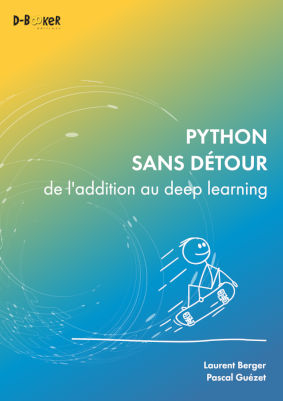

## Python sans détour
### de l'addition au deep learning

Ce dépôt contient les codes sources des exemples du livre [Python sans détour – de l'addition au deep learning](https://www.d-booker.fr/python/724-python-sans-detour.html), écrit par Laurent Berger et Pascal Guézet, paru le 24/05/2022 aux éditions [D-BookeR](http://www.d-booker.fr). 

Si ces exemples vous intéressent et que vous n'avez pas acheté le livre, nous vous invitons à le [faire](https://www.d-booker.fr/opencv-py/609-traitement-d-images-et-de-videos-avec-opencv-4-en-python.html). Sa rédaction est le fruit d'un gros travail et votre soutien nous sera précieux.

